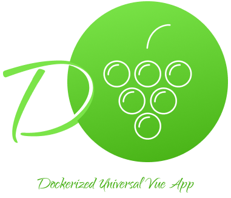
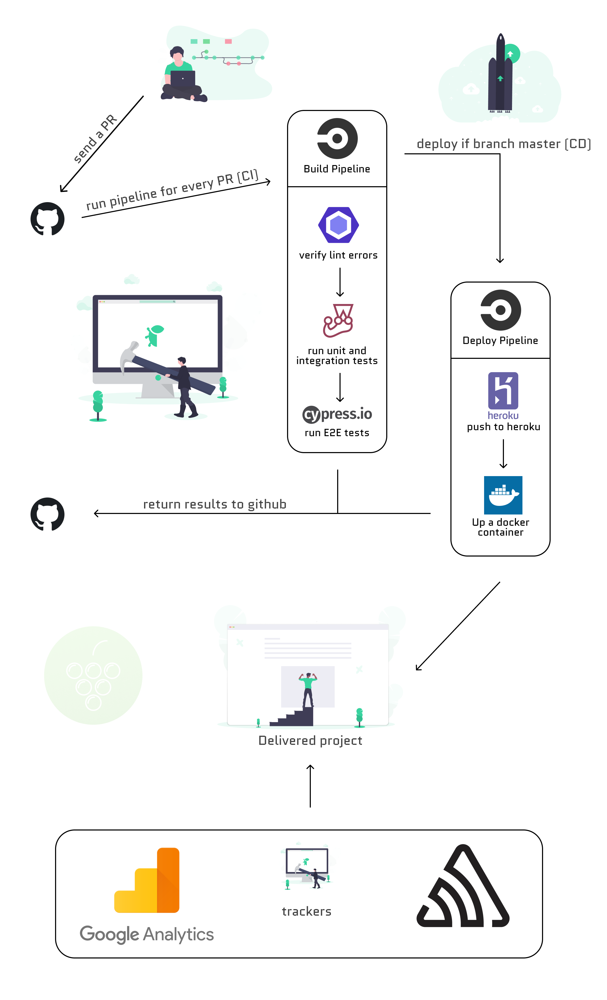

# DUVA

Dockerized universal Vue App is a Nuxt boilerplate with other awesome stuff

<p align="center">
  
</p>

## Running the app using docker

Just download the docker if you don't have it and run the command below:

Prerequisite: Docker

```bash
# Set the node, cypress dependencies, install project dependencies and start dev server
docker-compose up
```

## Build Setup

```bash
# install dependencies (use only npm instead of yarn)
$ npm run install

# serve with hot reload at localhost:3000
$ npm run dev

# build for production and launch server
$ npm run build
$ npm start

# generate static project
$ npm run generate
```

## Running the tests

```bash
# run unit/integration tests
npm run test

# run e2e (headless mode) tests
npm run e2e
```

## Configuring CI/CD

### QA Flow

<p align="center">
  
</p>

### CD (Heroku)

1. Create an app into Heroku
2. [Set the stack to container (docker)](https://devcenter.heroku.com/articles/build-docker-images-heroku-yml#getting-started)

It will be deployed on branch master update

### CI (CircleCI)

1. Setup the CircleCI on your repository
2. [Set the HEROKU_APP_NAME and HEROKU_API_KEY environment variables](https://circleci.com/docs/2.0/deployment-integrations/#heroku)

It will be ran on PR creation

## Built on Nuxt Js

- [x] Vue
- [x] vuetifyjs
- [x] Sass
- [x] Jest
- [x] PWA
- [x] Universal APP (Server side rendering)
- [x] Prettier / Lint / Husky
- [x] Cypress preconfig
- [x] Docker preconfig (Production mode)
- [x] JavaScript Error Tracking - [Sentry](https://sentry.io/for/javascript/)
- [x] Follow the [angular commit conversion](https://gist.github.com/stephenparish/9941e89d80e2bc58a153)
- [x] CircleCI preconfig
- [x] Google Analytics preconfig
- [x] Heroku (Docker)

For detailed explanation on how things work, checkout [Nuxt.js docs](https://nuxtjs.org).
